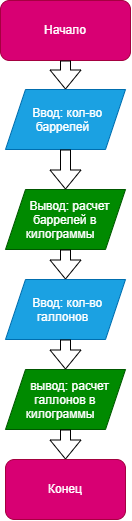

# Домашнее задание к работе 3

## Условие задачи  
Написать и отладить программу пересчета баррелей и галлонов в килограммы
## 1. Алгоритм и блок-схема

### Алгоритм
1. **Начало**
2. Ввести кол-во баррелей :
   - `scanf("%d", &barrel)`  
3. Вывести рассчитаный перевод баррелей в килограммы:
   - `printf("%d баррелей – это %f килограмм\n", barrel, resultb * 158.987);`  
4. Ввести кол-во галлонов:
   - `scanf("%d", &gallon);`  
5. Вывести рассчитаный перевод галлонов в килограммы:
   - `printf("%d галлона - это %f килограмм\n", gallon, resultg * 3.7854)`  
6. **Конец**

### Блок-схема
 


## 2. Реализация программы
```C++
#include <stdio.h>  
#include <locale.h>  
int main()  
{  
	setlocale(LC_CTYPE, "RUS");  
	int barrel;  
	float resultb;  
	int gallon;  
	float resultg;
	puts("Введите количество баррелей для расчета");
	scanf("%d", &barrel);
	resultb = barrel;
	printf("%d баррелей – это %f килограмм\n", barrel, resultb * 158.987);
	printf("Введите количество галлонов для расчета");
	scanf("%d", &gallon);
	resultg = gallon;
	printf("%d галлона - это %f килограмм\n", gallon, resultg * 3.7854);
}
```
## 3. Результаты работы программы

>Введите количество баррелей для расчета  
>3  
>3 баррелей - это 476.961000 килограмм  
>Введите количество галлонов для расчета  
>3  
>3 галлона - это 11.356200 килограмм  

## 4. Информация о разработчике

### Чудакова Екатерина бИЦТ-261
